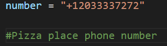
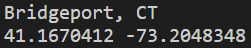
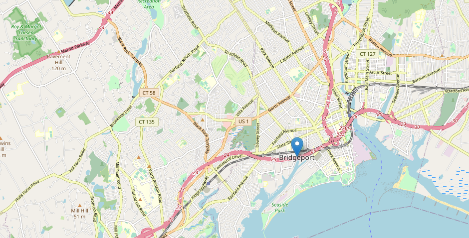

# Phone-Number-Location-Python

This is a... 


## What I Learned/Project Covers

```
- Tracking Phone Number Location Using Python
- Creating Python Project Directory
- Creating Number File For Experiment
- Installing Phonenumbers Python Library
- Extracting Data From Number
- Installing OpenCage Geocoding Module for Python
- Addling OpenCage Geocoding API
- Using Longitude & Latitude
- Installing folium For Connecting Map
- Generating Map File In Folder
```

## Pictures

Phone Number:

 

Phone Number Details:

 

Location of Phone Number:

 


